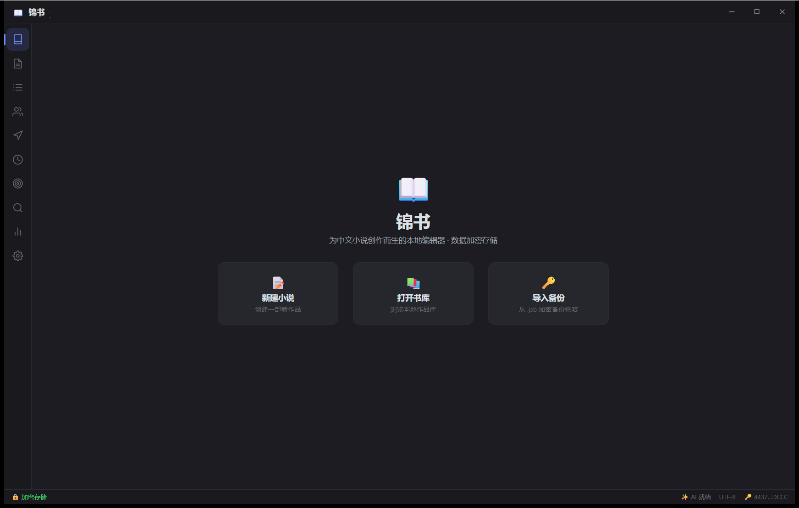

# 📖 锦书 · 小说编辑器（JinShu-rust）

为中文小说创作而生的本地编辑器。**Tauri v2（Rust 后端 + Vue 3 Web 前端）**构建，现代化 IDE 风格界面，章节树 / 大纲 / 人物关系网 / 世界观 / 时间线 / 任务看板 / 写作统计开箱即用，AI 创作助手可接入你自己的大模型 API Key，**全部数据以 AES-256-GCM 加密文件缓存于软件安装目录**，不写入任何系统目录。



---

## ✨ 功能总览

| 模块 | 说明 |
| --- | --- |
| 📑 章节管理 | 卷/章树形结构、多标签页、自动保存、拖拽排序（上移/下移）、字数实时统计 |
| ✍️ 编辑器 | CodeMirror 6：行号、当前行高亮、行距/字距/字号/字体（宋体/黑体）调节、查找替换、跨标签页撤销历史、全局搜索、Markdown 高亮开关（中文写作默认关闭，`#` `*` 原样显示） |
| 🗂 大纲 | 树形大纲（卷→章→节→要点）、从 AI 回复一键应用为大纲、节点增删改 |
| 👥 人物 | 人物卡（外貌/性格/背景/目标）、角色定位、**关系网画布**（可拖拽布局） |
| 🗺 世界观 | 地点层级树（国家→城市→建筑）、设定描述 |
| ⏱ 时间线 | 事件按时间排序、关联章节 |
| 🎯 任务 | 任务链 + 看板（待办/进行中/已完成） |
| 📊 统计 | 总字数、今日新增、连续创作天数、近 30 天柱状图、各卷字数 |
| ✨ AI 助手 | 续写、章节细纲、润色、扩写、摘要、剧情提示、逻辑检查、全稿一致性检查、整稿评审、人物卡、世界观、起名、简介；自由对话；流式输出；**Lorebook 式自动注入**（正文出现人物/地名时自动附带对应设定卡）；结果可一键插入正文 / 复制 / 重新生成 / 应用为大纲 / 设为摘要 |
| 🔍 命令面板 | Ctrl+P 全局命令、Ctrl+F/Ctrl+H 查找替换、Ctrl+Shift+F 跨章节搜索 |
| 📤 导出 | **txt**（纯文本）、**md**（Markdown）、**jsb**（密码加密备份，Scrypt 派生密钥，可跨设备恢复） |
| 🎨 外观 | 深色/浅色主题、8 种强调色预设、界面缩放、专注模式 |

## 🔒 数据安全模型

- **加密缓存**：所有作品、章节、设置（含 AI API Key）均以 **AES-256-GCM** 加密文件存储于**安装目录** `data/` 下，磁盘上不存在任何明文文件（已由自动化测试验证）。
- **密钥管理**：首次运行在 `data/.jinshu_key` 生成随机 32 字节密钥；密钥指纹显示于状态栏与设置页。
- **不污染系统**：不向 `%APPDATA%`、`~/.local`、`%TEMP%` 等系统目录写入任何持久文件。
- **安全边界**：本方案防御"随手读盘"类威胁（其他程序直接读文件只能看到密文）。由于密钥与数据同机，无法防御针对性的同权限攻击；如需更强保护，请使用导出 `.jsb` 加密备份（密码不落盘）。
- **数据目录位置**：可执行文件同目录 `data/`（可通过环境变量 `JINSHU_DATA_DIR` 覆盖）。

## 🤖 AI 服务接入（自带 Key，不经过任何中转）

`设置 → AI 服务`：

| 项目 | 说明 |
| --- | --- |
| 协议 | OpenAI 兼容（绝大多数服务）或 Anthropic |
| 服务商预设 | DeepSeek、Moonshot、通义千问、智谱 GLM、Ollama 本地、自定义 |
| Base URL | 中转/代理可自定义 |
| 模型 | 任意模型名，如 `deepseek-chat`、`qwen-plus`、`claude-sonnet-4-5` |
| API Key | 掩码显示，加密落盘，仅在你调用时发送给你配置的服务商 |

**Lorebook 注入**：开启"自动注入设定"后，AI 请求会自动携带当前正文中出现的人物/地点设定卡，保证角色言行一致。

## 🚀 快速开始

### Windows 11

1. 下载 `JinShu-rust-win64-tauri.zip`（约 4MB），解压到任意目录（如 `D:\Apps\JinShu`）
2. 双击 `JinShu.exe`（Win10/11 自带 WebView2，无需安装任何运行时）
3. 数据保存在 exe 同目录 `data/`，整个文件夹可随身携带

### Arch Linux

**方式一：AUR 风格打包（推荐）**

```bash
cd packaging/arch
makepkg -si        # 安装到系统
```

> 注意：系统级安装时 `/opt/jinshu-rust` 默认不可写，请在启动前设置 `JINSHU_DATA_DIR=~/jinshu-data`（或 `sudo chown -R $USER /opt/jinshu-rust`，数据即可直接落在安装目录）。

**方式二：便携版**

```bash
bash build_pkg_arch.sh   # 在项目根目录（需要 Rust 工具链）
# 产物: dist/JinShu-rust-arch-x86_64.tar.gz —— 解压到 ~/Apps 直接运行
./JinShu
```

依赖：`webkit2gtk-4.1 gtk3 noto-fonts-cjk`（PKGBUILD 已声明）；中文字体来自系统 noto-fonts-cjk。

### 从源码构建

```bash
# 1. 前端
cd frontend && npm install && npm run build && cd ..
# 2. 后端（自动嵌入前端产物）
cd src-tauri && cargo build --release
./src-tauri/target/release/jinshu   # Windows: jinshu.exe
```

需要 Rust 1.85+ 与 Node 20+。

## ⌨️ 快捷键

| 快捷键 | 功能 |
| --- | --- |
| Ctrl+N / Ctrl+O / Ctrl+S | 新建小说 / 打开书库 / 保存 |
| Ctrl+P | 命令面板 |
| Ctrl+F / Ctrl+H / Ctrl+Shift+F | 查找 / 替换 / 全局搜索 |
| Ctrl+B / Ctrl+J | 切换侧边栏 / AI 助手面板 |
| Ctrl+= / Ctrl+- | 编辑区字号增减 |
| Ctrl+W | 关闭当前标签页 |

## 🧪 测试

```bash
cargo test    # 加密往返 / 密码备份 / 字数统计 / 导出格式 / 大纲解析 / 加密落盘 7 项
```

## 🏗 技术栈

Rust + Tauri 2 · Vue 3 · CodeMirror 6（编辑器：行号/高亮/查找替换/撤销历史）· AES-256-GCM（RustCrypto）· Scrypt（.jsb 备份）· ureq（AI 流式客户端）

## 📄 许可

MIT —— 完全开源，可自由商用。
